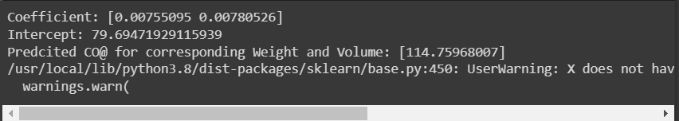

# Implementation of Multivariate Linear Regression
## Aim
To write a python program to implement multivariate linear regression and predict the output.
## Equipment’s required:
1.	Hardware – PCs
2.	Anaconda – Python 3.7 Installation / Moodle-Code Runner
## Algorithm:
## Step 1:
Import pandas as pd.
## Step 2:
Read the csv file
## Step 3:
Get the values of X and Y variables
## Step 4:
Create the linear regression model and fit
## Step 5:
Predict the CO2 emission of a car where the weight is 3300kg, and the volume is 1300cm3  
## Step 6:
Print the predicted output
## Program:
```python
# Developed by: Udayakumar R
# Reference N0: 22008609

import pandas as pd
from sklearn import linear_model
df=pd.read_csv('cars.csv')
x=df[['Weight','Volume']]
y=df['CO2']
regr=linear_model.LinearRegression()
regr.fit(x,y)
print("Coefficient:",regr.coef_)
print("Intercept:",regr.intercept_)
predictCO2=regr.predict([[3300,1300]])
print("Predcited CO@ for corresponding Weight and Volume:",predictCO2)
```
## Output:
<br>

## Result
Thus the multivariate linear regression is implemented and predicted the output using python program.